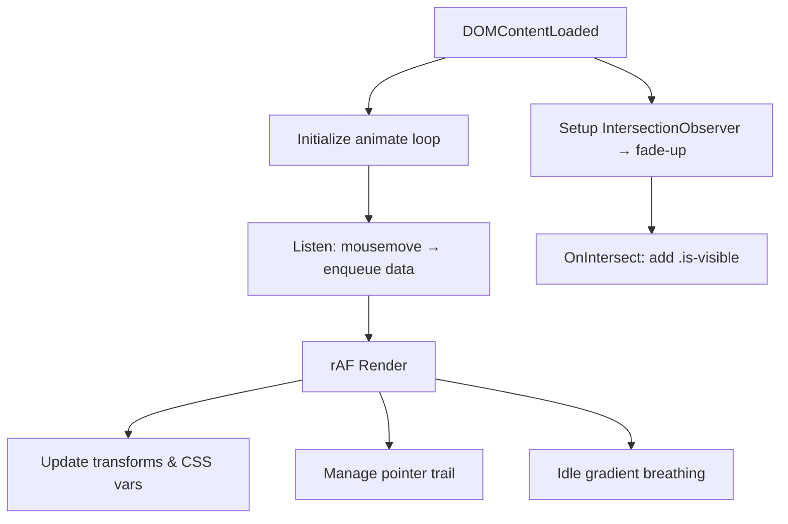

# Feature Design: Interactive Floating Pointer & Dynamic Gradient

**Goals**

1. Elevate fluidity with subtle parallax and easing.  
2. Add layered hover/scroll animations.  
3. Enrich pointer with glow and trail effects.  
4. Maintain performance via GPU-accelerated transforms and requestAnimationFrame.

**1. Enhanced Mouse-Driven Parallax**

- Track mouse movement; batch updates in a single `requestAnimationFrame` loop.  
- Apply different depth factors to layers:  
  - Hero background shapes: `data-depth="0.02"`.  
  - Text and buttons: `data-depth="0.05"`.  
- Position transforms via `translate3d(dx * depth, dy * depth, 0)`.

**2. Dynamic Gradient Transitions**

- CSS variable `--gradient-hue` to control color base.  
- On mousemove or scroll: update `--gradient-hue` with easing (`transition: background 1s ease-out`).  
- Idle “breathing” animation via CSS keyframes when no interaction.

**3. Pointer Styling & Trail**

- Pointer as semi-transparent ring with glow:  
  ```css
  #floating-pointer {
    width: 24px;
    height: 24px;
    border: 2px solid rgba(255,255,255,0.7);
    box-shadow: 0 0 12px rgba(255,255,255,0.4);
    border-radius: 50%;
    mix-blend-mode: difference;
    pointer-events: none;
  }
  ```  
- Trail: maintain an array of last 5 positions; render fading dots (`.pointer-dot`) with CSS fade-out.

**4. Scroll-Triggered Fade-Ins & Slide-Ups**

- Use `IntersectionObserver` to toggle `.is-visible`.  
- CSS classes:  
  ```css
  .fade-up {
    transform: translateY(20px);
    opacity: 0;
    transition: transform .6s ease, opacity .6s ease;
  }
  .fade-up.is-visible {
    transform: translateY(0);
    opacity: 1;
  }
  ```

**5. Button & Link Hover Dynamics**

- Buttons: `transform: scale(1.05); box-shadow: 0 0 8px rgba(0,0,0,0.2);`  
- Links: underline slide-in with `::after` and `transition`.

**6. Files & Sections to Modify**

- **index.html**  
  - Wrap decorative elements in `<div class="parallax-layer" data-depth="...">`.  
  - Add `<div id="floating-pointer"></div>` and `<div class="pointer-trail"></div>`.  
  - Add `data-animate="fade-up"` to target sections.

- **css/styles.css**  
  - Extend `:root` with `--gradient-hue`, `--idle-duration`, etc.  
  - Add rules for `.parallax-layer`, `.fade-up`, `.pointer-dot`, hover animations, and keyframes.

- **js/main.js**  
  - Create unified `animate()` loop for mouse input, pointer, gradient idle, and parallax.  
  - Setup `IntersectionObserver` for scroll animations.  
  - Manage pointer-trail DOM elements.

**7. Performance Considerations**

- Single `requestAnimationFrame` loop for all interactions.  
- GPU-accelerated `translate3d` transforms and CSS-only transitions.  
- Reuse DOM elements for pointer trail; throttle any heavy calculations.

**8. Implementation Plan**



**Step-by-Step:**

1. HTML: Insert `.parallax-layer` wrappers, pointer, trail, and fade-up markers.  
2. CSS: Define variables, layer styling, pointer/trail rules, fade-up, hover animations, and keyframes.  
3. JS: Implement single `animate()` loop; handle mouse input, idle breathing, parallax, and trail.  
4. Scroll Animations: Configure `IntersectionObserver` and apply `.is-visible`.  
5. Test & Tweak: Adjust depth factors, easing durations, and performance profiling.